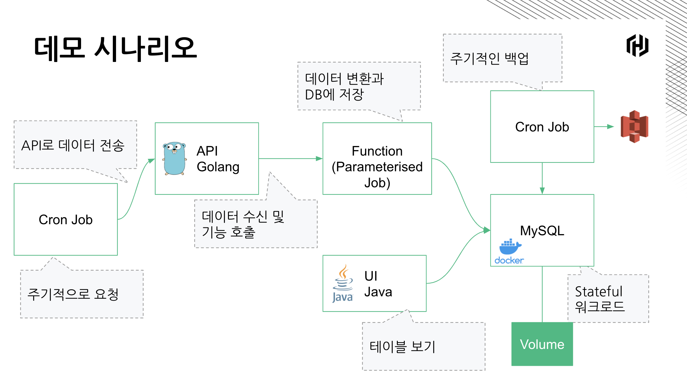

## Run Nomad via Vagrant
> [Vagrant Download](https://www.vagrantup.com/downloads)
* `vagrant up` on nomad-server
    * replace ip `script.sh` and `nomad.d/*.hcl`
    * if changing IP, `vagrant reload --provision`
* `vagrant up` on nomad-client
    * replace ip `script.sh` and `nomad.d/*.hcl`
    * if changing IP, `vagrant reload --provision`
* Check the UI
    * Nomad UI - http://[nomad-server]:4646
    * Consul UI - http://[nomad-server]:8500

## Set-up

* Create a S3 Bucket
* Replace `s3://gs-mysql-dump/` to your bucket name in the `dump-mysql.sh`, `init.sh`, and `periodic-backup.hcl`.

## Demo
* `nomad job run mysql.hcl`
    * when the first time,
       * `mysql -h ${MYSQL_HOST} -u root -prooooot -D handson -e "drop table if exists animals"`
       * `mysql -h ${MYSQL_HOST} -u root -prooooot -D handson -e "create table animals (animal varchar(100));"`
* `nomad job run ui-java.hcl`
   * Open the browser. `http://[nomad-client]:8080/`
* `./insert-dog.sh`
* `nomad job run parameterized-toupper.hcl`
* `echo "cat" | nomad job dispatch r2-parameterized-toUpper -`
* `nomad job run front-api-go.hcl`
* `curl [nomad-client]:8888/animal/pig`
* `nomad job run periodic-backup.hcl`
* `nomad job run periodic-curl.hcl`

## Clean-up
* `./init.sh`
